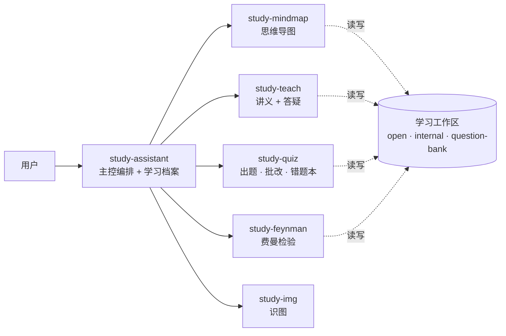

# 📚 Study Assistant — AI 学习辅导老师

[](https://github.com/2362094903-ops/study-assistant-skills/releases)
[](LICENSE)
[](https://claude.com/claude-code)

一套用于 [Claude Code](https://claude.com/claude-code) 的系统化学习 Skill 套件。**考研、期末考试、资格证书备考都适用**——上传教材、课件、讲义或任何学习资料，它会像一位严格但耐心的辅导老师一样带你**按章节吃透**：

> 画思维导图 → 每次生成一个知识点讲义 → 自动合并并审查整章主讲义 → 按目标院校真题风格出题 → 交互试卷即时判分 → 错题本换壳复盘 → 费曼检验验收 → 仪表盘追踪掌握度。**学习进度跨会话保存**，随时"继续学习"接着上次的进度。

*A study-tutor skill suite for Claude Code — works for any exam or course (graduate entrance exams, university finals, certifications): mind maps, one-knowledge-point-at-a-time lecture generation, audited chapter HTML, exam-style interactive quizzes, a global question bank, a mistake book, Feynman verification, and a mastery dashboard — all state persisted across sessions.*

---

## ✨ 亮点

- 🧠 **交互式思维导图**：零依赖单文件 HTML，折叠/缩放/搜索，知识点**按掌握度着色**——学到哪绿到哪；节点只显示知识点短名，悬停看全称，清爽不拥挤
- 📖 **整章讲义闭环**：每次只生成一个知识点的 JSON + HTML，保证长章节后半段不降质；最后一个知识点完成后，自动按小节合并为整章主 HTML，并检查知识点覆盖、图表、公式和例题是否漏入讲义；发现问题先修补再刷新仪表盘
- 🧩 **稳定一致的渲染**：**深入讲解 / 考试速通双模式**任选；例题按上传题目、全局题库考频和课件原题分配；HTML 例题可交互作答，Markdown 表格、MathJax 公式、函数图和来源标注均由固定脚本渲染，不同模型产物结构更一致
- ✍️ **真题风格出题**：上传真题或历年试卷优先；没有题目时可选择自行上传或让 AI 联网搜索；交互试卷支持单选/多选/判断/主观题和 MathJax 公式，**做完一题立即显示答案与解析**；纸上手写作答拍照也能批改
- 🔁 **错题闭环**：错题自动入本，复盘时换数字换情境重考，答对才销账；全书模拟卷按"重要度高 × 掌握度低"抽样暴露短板
- 🗣️ **费曼检验**：你讲给"聪明的初学者"听，它追问漏洞、评 1–5 分掌握度、出章节掌握报告
- 📊 **学习仪表盘**：直接连接整章主 HTML、最近题目和审查报告，显示章节 `待合并 / 待审查 / 需修改 / 已完成` 状态；双击 `update_dashboard.command` 即可一键刷新
- 🗂️ **清晰文件分类**：用户常打开的内容集中在 `open/`；JSON、Markdown、单知识点 HTML、审查报告和源材料归入 `internal/`；课程级题库单独放在 `question-bank/`
- ♻️ **全局题库复用**：整门课程只维护一个题库，不按章节重复建库；出过的题和讲义例题自动入库，再次出题先查库改编
- 👁️ **识图自适应**：模型有视觉能力就直接看；没有则调用**你自己配置的**视觉模型 API（OpenAI 兼容 / Anthropic 格式均可），扫描版教材、试卷照片、手写答案都能处理

## 🏗️ 架构



| Skill | 职责 |
|---|---|
| `study-assistant` | **主控**：建档、编排全流程、节奏控制、跨会话续学（只读 30 行摘要） |
| `study-mindmap` | 交互思维导图，掌握度着色，随学习进度刷新 |
| `study-teach` | 每次一个知识点讲义；支持深入讲解/考试速通、交互例题、表格、函数图、来源标注；章节完成后强制合并并审查整章主 HTML |
| `study-quiz` | 上传题目优先、可选联网找题、MathJax 交互试卷、批改、错题本、模拟卷、课程级全局题库 |
| `study-feynman` | 费曼检验、掌握度评分、章节掌握报告 |
| `study-img` | 原生视觉优先；无视觉则调用用户自配 API（OCR / 图表描述 / 手写转录） |

所有产物（导图/试卷/讲义/仪表盘）由**模型写结构化 JSON、打包脚本渲染**——换什么模型驱动，页面长一个样；状态文件有校验脚本兜底。

## 🚀 安装

### Claude Code（命令行 / 桌面版 / IDE 插件）

```bash
git clone https://github.com/2362094903-ops/study-assistant-skills.git
cp -r study-assistant-skills/study-* ~/.claude/skills/
pip3 install pymupdf python-pptx   # 处理 PDF 教材和 PPT 课件需要；其余功能零依赖
```

### Claude 桌面应用（claude.ai App）

从 [Releases](https://github.com/2362094903-ops/study-assistant-skills/releases) 下载 6 个 `.skill` 文件，在 **设置 → Capabilities → Skills** 中上传。注意：沙箱环境下跨会话续学等依赖本地文件的能力会受限，完整体验请用 Claude Code。

## 📖 快速开始

```
开始学习 ~/Documents/课程/微观经济学.pdf 第三章
```

其余常用说法：

| 你说 | 它做 |
|---|---|
| `继续学习` | 读 30 行摘要恢复状态，汇报进度，接着学 |
| `生成下一个知识点讲义` | 每次只产出一个知识点讲义（Obsidian / HTML） |
| `没听懂 XXX，换个讲法` | 换比喻换例子重讲（不复读讲义） |
| `这是真题/历年试卷 <文件>` | 分析命题风格，之后出题都模仿它 |
| `出题考我` / `来套模拟卷` | 打开交互试卷 → 做完导出作答记录贴回 → 批改+错题本 |
| 拍照上传手写答案 | OCR 忠实转录（不纠错）→ 你确认 → 批改 |
| `用费曼学习法检验我` | 你讲、它追问、评分、出报告 |
| `复盘错题本` | 错题换壳重考，答对销账 |
| `打开仪表盘` | 主讲义/题目/审查报告/掌握度/章节完整性一页看全 |
| `开始学习 课件.pptx 第三章` | 提取 PPT 课件文字，图片页标记待 OCR |
| `合并并审查本章主讲义` | 合并全部知识点，检查漏图/漏公式/漏例题，修正后发布主 HTML |

学习数据存在教材文件旁的 `<教材名>-study/` 文件夹：

```
<教材名>-study/
├── open/
│   ├── dashboard.html
│   ├── update_dashboard.command
│   ├── chapters/chapter-XX.html
│   └── quizzes/*.html
├── internal/
│   ├── state/          # knowledge/progress/history/digest/exam-style/mistakes
│   ├── textbook/       # 提取后的章节材料
│   ├── lessons/        # 单知识点 JSON/HTML/Markdown
│   ├── mindmaps/
│   ├── quizzes/        # 题目 JSON
│   └── reports/        # 章节审查/模拟考/费曼报告
└── question-bank/
    └── question-bank.json
```

删除该文件夹 = 重置进度；备份它 = 备份全部学习记录。把它用 Obsidian 作为 vault 打开，讲义公式即原生渲染。

## 🔧 识图配置（仅当你的模型没有视觉能力时）

模型本身能看图（如 Claude Sonnet/Opus）则零配置。否则首次识图时会引导你配置，写入 `~/.config/study-img/config.json`：

```json
{
  "provider": "openai",
  "base_url": "https://dashscope.aliyuncs.com/compatible-mode/v1",
  "api_key": "<你的密钥>",
  "model": "qwen3.5-flash"
}
```

- `openai`：任何 OpenAI 兼容接口（DashScope / 智谱 / Moonshot / SiliconFlow / OpenRouter / OpenAI…）
- `anthropic`：Anthropic Messages API（`base_url` 可省略）
- 也支持环境变量 `STUDY_IMG_*`；验证：`python3 ~/.claude/skills/study-img/scripts/recognize.py --show-config`

密钥只存你本机，不会出现在仓库或学习档案中。

## ❓ FAQ

**对模型有什么要求？** 任何能跑 Claude Code 的模型都行。指令为英文编写以提高跨模型遵循度，输出强制简体中文；产物由脚本渲染保证一致性。模型无视觉能力时识图走外部 API。

**公式怎么渲染？** 讲义和试卷均支持 LaTeX（HTML 经 MathJax CDN，离线退化为源码显示）；思维导图继续使用简洁的 Unicode 数学表达。

**我的教材和学习数据会上传吗？** 不会。所有档案都是你本机的纯文本/HTML 文件。唯一的外部调用是：①无视觉模型时的识图 API（你自己的）；②你主动要求联网找真题时的网页检索。

**多选题怎么计分？** 默认按考研惯例"错选漏选均不得分"，出题时可设 `partial: true` 改为漏选无错选得半分。

**为什么讲义按知识点生成而不是一次出整章？** 单次生成内容越长，后半段质量越容易下滑。每次只生成一个知识点可稳定质量；章节最后会自动合并、审查并发布一个方便打开的整章主 HTML。

## 📄 License

[MIT](LICENSE)
